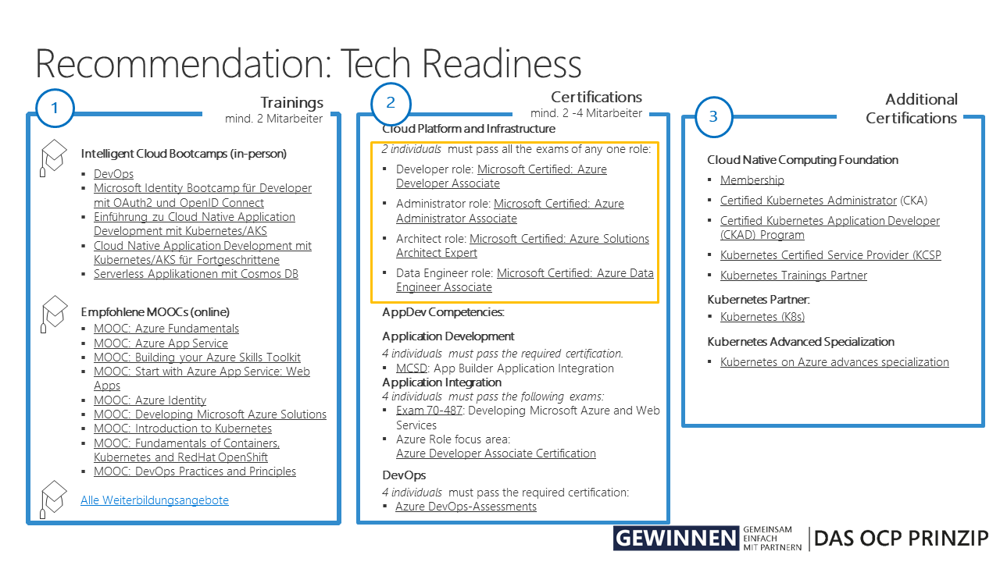

# Cloud Native App Dev Trainings & Certifications #

Obviously Microsoft has a ton of resources to keep you busy. So you might ask yourself what do I really need to be "ready"? Here's our recommendation to all developers:

First of all, take a test on (aka.ms/MSPracticeTests "Measure Up") to assess your current knowledge and learn about your development areas.

## Courses ##

Start with some online courses. Complete learning path are available on  Microsoft Learn oder Pluralsight. Tipp: Create your learning profile with your private email address and conect this to your professional/company's account. This way, you can take the certification with you from one to the other employer (of course we do not want to motivate anybody to change jobs). 

Intelligent Cloud Bootcamps (in-person):
+ DevOps 
+ Microsoft Identity Bootcamp für Developer mit OAuth2 und OpenID Connect 
+ Einführung zu Cloud Native Application Development mit Kubernetes/AKS 
+ Cloud Native Application Development mit Kubernetes/AKS für Fortgeschrittene 
+ Serverless Applikationen mit Cosmos DB

MOOCs (online):

+ MOOC: Azure Fundamentals​
+ MOOC: Azure App Service​
+ MOOC: Building your Azure Skills Toolkit​
+ MOOC: Start with Azure App Service: Web Apps​
+ MOOC: Azure Identity​
+ MOOC: Developing Microsoft Azure Solutions​
+ MOOC: Introduction to Kubernetes​
+ MOOC: Fundamentals of Containers, Kubernetes and RedHat OpenShift​
+ MOOC: DevOps Practices and Principles

## Azure Certification ##

When you feel ready, take your first real exam. 

We recommend companies to achieve Cloud Platform competency which is per se Microsofts "Azure" certification and resembles the scope of experties in Microsofts could infrastructure and services. It requires that at least two individuals pass all the exams of any of the following roles:

+ Developer role: Microsoft Certified: Azure Developer Associate
+ Administrator role: Microsoft Certified: Azure Administrator Associate
+ Architect role: Microsoft Certified: Azure Solutions Architect Expert
+ Data Engineer role: Microsoft Certified: Azure Data Engineer Associate

(There are specific learning path for all competencies on Microsoft Learn.)

Microsoft also offers certifications in *AppDev*, *App Integration* and *DevOps*. All exams require that at least 4 inidviduals pass one of the following exams per certification:

+ Application Development: Azure Developer Associate Certification
+ Application Integration: Azure Developer Associate Certification
+ DevOps: DevOps Engineer Expert Certification (Prerequisite certifications required: Azure Developer or Azure Admin)

Important: The Application Integration can be achieved with other certifications depending on the focus area which are are very much focued on .NET. Please be aware and directly invest in cloud platform if you come from the open source world. 

## Advanced Specialization ## 
Microsoft advanced specializations go beyond gold competencies. The advanced specialization provides a means for you to showcase proven, verifiable expertise in a product, solution area, or service. Customers will be able to see both your Gold competency and your advanced specialization in your business profile on the partner directory. To receive an advanced specialization tag, your business must fully meet a set of published criteria and be validated by Microsoft. So far, Microsoft offers 5 advanced specializations. The follwoing two are of interest for you:
+ Kubernetes on Microsoft Azure Partner employs DevOps practices for AKS implementations and demonstrates expertise in deploying and managing production workloads in the cloud using containers and managing hosted Kubernetes environments in Microsoft Azure. Modernization of Web Applications in Microsoft Azure Partner ensures customer success in application development, and familiarity with content management systems. Demonstrate expertise in migrating and deploying production web application workloads, applying DevOps practices, and managing application services in Microsoft Azure. (Please see: [Tech Enablement Plan](./TechEnablementPlanAdvancedSpecializationforKubernetes.md) and [AKS Advanced Specialization](./AKSSampleOfferOnePager.pdf)
+ Linux and Open Source Database Migration to Microsoft Azure Partner is highly knowledgeable in open source technologies and demonstrates expertise in migrating and optimizing production workloads running on Red Hat Enterprise Linux (RHEL) or SUSE virtual machines and/or MariaDB, PostgreSQL, MySQL, CassandraDB, MongoDB databases to Azure.

# External Certifications # 

Cloud Native Computing Foundation
+ Membership
+ Certified Kubernetes Administrator (CKA) 
+ Certified Kubernetes Application Developer (CKAD) Program
+ Kubernetes Certified Service Provider (KCSP
+ Kubernetes Trainings Partner

Kubernetes Partner 

