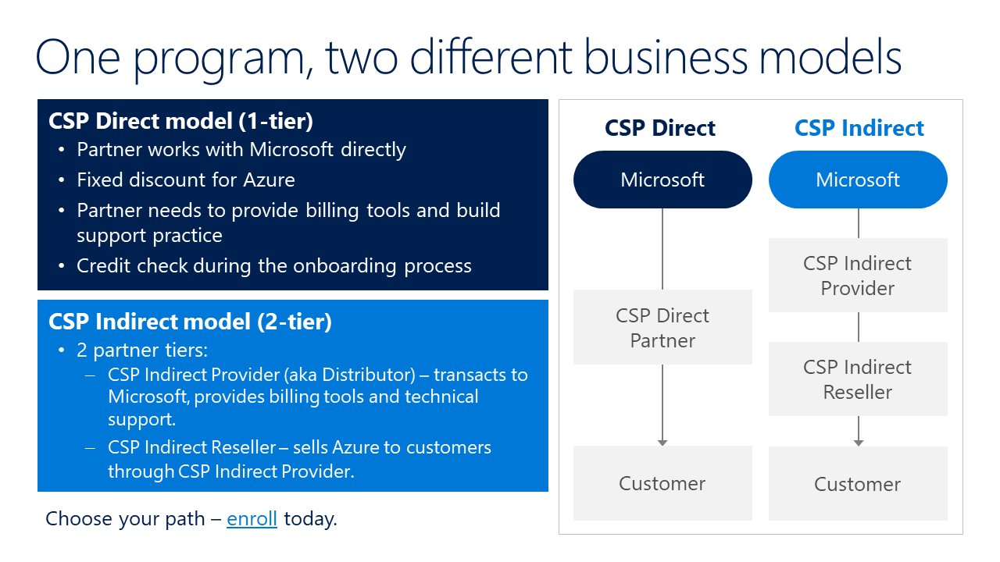

# Further Questions # 
## How to develop a solution or consulting service and publish it in Microsoft's commercial marketplaces ##
Before publishing a solution or consulting service in one of Microsoft's commercial either decide which of your exixting solutions you want to position though this channel or develop it. Here are a few tips and sources for the second option:

*Build solutions with Azure*:

Independent whether you are building from scratch, migrating from on-premise, or migrating from or augmenting another cloud provider.

If you develop something new, visit:
+ [Azure developer guide](https://docs.microsoft.com/is-is/azure/guides/developer/azure-developer-guide)
+ [Azure application architecture guide](https://docs.microsoft.com/is-is/azure/architecture/guide/)
+ [Developing best practice](https://docs.microsoft.com/is-is/azure/architecture/best-practices/api-design)
+ Install [Aladdin](https://azure.microsoft.com/is-is/blog/help-improve-our-azure-docs/), an AI assistant, that connects you to relevant Azure docs to accomplish your work more efficiently

If you migrate existing apps:
+ Use guidance from the [Azure Migration Center](https://azure.microsoft.com/is-is/migration/)
+ Join the [data accelerate program](https://info.microsoft.com/microsoft-data-accelerator-program-register.html) to modernize your applications across on-premises and cloud (migrate an existing SQL Database solution to Azure)
+ Guidance for on-prem [Windows Server on Azure](https://azure.microsoft.com/is-is/campaigns/windows-server/)
+ [Application Innovation Technical Journeys](https://partner.microsoft.com/en-US/support/azure-presales-deployment) 

*Build a consulting practice*:

+ Leverage one of our [practice frameworks](https://partner.microsoft.com/en-US/solutions/build-a-practice) e.g. [Define your solution](./DesignYourSolution.pdf)
+ Use a [cloud practice playbook](https://partner.microsoft.com/en-US/campaigns/cloud-practice-playbooks) (ie. cloud application development, artificial intelligence, and cloud migration)
+ Build a [managed service](https://azurecsp.blob.core.windows.net/files/azure-msp-playbook.pdf) 

## How to measure AZURE business performance/partner contribution using methods of partner associations? ##

DPOR = Digital Partner of Records

Digital Partner of Record associates servicing partners to a Microsoft cloud subscription. Partners must be added as the DPOR each time a new subscription is sold, regardless of whether their customer is new or existing. Microsoft policy is that only the customer can designate a DPOR for their subscriptions
A partner may earn Microsoft Azure Incentives where they are attached as the Digital Partner of Record (DPOR), as long as the subscription remains current for the duration of the incentive. The partner will only earn from the month they are assigned as DPOR, or the month of competency attainment, whichever is later. 
Process:  The customer assigns the Partner as Digital Partner of Record (DPOR) in the Azure Portal.
[Guidance](https://support.microsoft.com/fr-fr/help/3045939/digital-partner-of-record-dpor).
(DPOR tracks Online Service Usage and Azure Consumption)

PAL = Partner Admin Link

Microsoft partners provide services that help customers achieve business and mission objectives using Microsoft products. When acting on behalf of the customer managing, configuring, and supporting Azure services, the partner users will need access to the customer’s environment. Using Partner Admin Link, partners can associate their partner network ID with the credentials used for service delivery. 
Process: Before Partner link partner ID, customer must give access to their Azure resources by using one of the following options: guest user, Directory account or service principal. Then, Partner use the Azure portal to link to a new partner ID or use PowerShell to link to a new partner ID
[Guidance Link Partner ID to Azure Accounts](https://docs.microsoft.com/en-us/azure/cost-management-billing/manage/link-partner-id). (PAL tracks Azure only)

## What's Azure Consumption and how is it measured? ##
Refers to how much cloud computing a customer is actually consuming. Usage is measured by meters. When you provision an Azure resource, Azure creates one or more meter instances for that resource. The meters track the resources' usage, and generate a usage record that is used to calculate your bill.
For example, a single virtual machine that you provision in Azure might have the following meters tracking its usage:
+ Compute Hours
+ IP Address Hours
+ Data Transfer In
+ Data Transfer Out
+ Standard Managed Disk
+ Standard Managed Disk Operations
+ Standard IO-Disk
+ Standard IO-Block Blob Read
+ Standard IO-Block Blob Write
+ Standard IO-Block Blob Delete

The meters and pricing vary per product and often have different pricing tiers based on the size or capacity of the resource. Check the documentation for specific details on what each service area costs. At the end of each monthly billing cycle, the usage values will be charged to your payment method and the meters are reset. You can check the billing page in the Azure portal at any time to get a quick summary of your current usage and see any invoices from past billing cycles.

## How to access GTM benefits ##
As a member of the Microsoft Partner Network you have access to resources, programs, and offers designed to help you grow your business. 

+ [Go-to-Market with Microsoft](https://partner.microsoft.com/en-US/solutions/go-to-market) 
+ [Create a Marketing Plan](https://partner.microsoft.com/de-de/smart-partner-marketing)
+ [Go-to-Market Services in Germany](https://partner.microsoft.com/de-de/marketing/microsoft-partnernews/marketing-vertrieb-gtm-services)

Branding & Logo Usage
+ [Branding for Partner](https://partner.microsoft.com/en-us/marketing/branding)
+ [Microsoft Trademark and Brand Guidelines](https://www.microsoft.com/en-us/legal/intellectualproperty/trademarks/usage/general.aspx) 
+ [Microsoft Corporate Logo Guidelines](https://www.microsoft.com/en-us/legal/intellectualproperty/trademarks/usage/logo.aspx)
+ [Logo Builder](https://logobuilder.partner.microsoft.com/Security/AuthenticationLoading?returnUrl=%2F)

## How to purchase Azure? ##
There are three main customer types on which the available purchasing options for Azure products and services are contingent, including:
+ *Enterprise* - Enterprise customers sign an Enterprise Agreement with Azure that commits them to spend a negotiated amount on Azure services, which they typically pay annually. Enterprise customers also have access to customized Azure pricing.
+ *Web direct* - Direct Web customers pay general public prices for Azure resources, and their monthly billing and payments occur through the Azure website.
+ *Cloud Solution Provider* - Cloud Solution Provider (CSP) typically are Microsoft partner companies that a customer hires to build solutions on top of Azure. Payment and billing for Azure usage occur through the customer's CSP.

As a Microsoft partner, you need to pick a licensing model and decide if you want to resell Azure.

All that's required is one Agreement either for customers or for partners:
+ [Microsoft customer agreement](https://www.microsoft.com/en-us/Licensing/how-to-buy/microsoft-customer-agreement)
+ [Microsoft partner agreement](https://www.microsoft.com/en-us/licensing/news/introducing-microsoft-partner-agreement)

## What's CSP? ##
The 
Cloud Solution Provider program (CSP) helps partners go beyond reselling licenses to being more involved in their customer's business.  

+ Deeper engagement with your customers - meeting regularly with your customers means you will develop a better understanding of their business and needs.
+ Increase your profits - Offering increased support and billing services, whether on your own or through an indirect provider, opens up new revenue streams.
+ Add value - You'll be able to offer customers industry-specific solutions bundled with Microsoft products.
+ Provide managed services - You'll be well-positioned to meet customer demand for managed services.

Decide on the model:

[Enrol](https://docs.microsoft.com/de-de/partner-center/enrolling-in-the-csp-program) in CSP program

Sources
+ [Cloud Solution Provider Documentation](https://docs.microsoft.com/de-de/partner-center/csp-overview)
+ [Microsoft Partner Agreement (MPA) for CSP partners](https://docs.microsoft.com/de-de/partner-center/microsoft-partner-agreement)
+ [Azure Documentation for Azure Cloud Solution Provider partners](https://docs.microsoft.com/en-us/previous-versions/azure/cloud-solution-provider/), further look [Azure101](./azure-in-csp101.pdf) 
+ [New requirments for CSP direct bill partners](https://docs.microsoft.com/de-de/partner-center/direct-partner-new-requirements)
+ [Transition from direct billed to indiret reseller](https://docs.microsoft.com/de-de/partner-center/transition-direct-to-indirect) 

