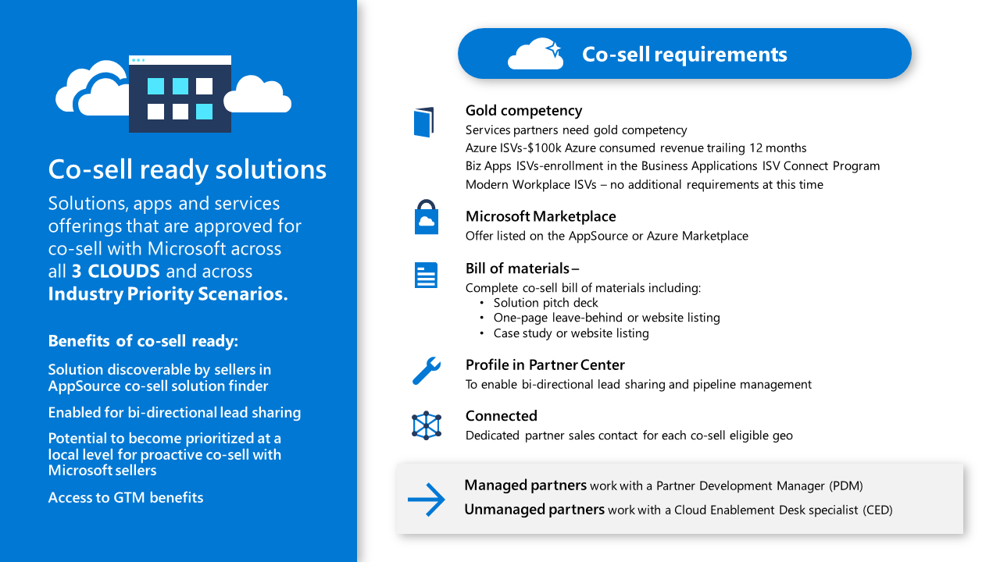

# Here's your minimum viable partnership #  
Partnering with Microsoft can be quite confusing. Especially when you are an app development company. You might ask yourself: "Where is my spot at Microsoft?" "Which program is designed for my needs as a developer?" "What are my perks?" "How much time do I need to invest?" And so on....Probably you start reading yourself into Microsofts partner website and will explore that the Microsoft partner world is pretty big and diverse. You might even think: "Ah the technology is nice but is it worth all the red tape trouble?"

As a tech provider who has a strong footprint in Cloud Apps & Infra, Biz Aps, Modern Workplace and serves different types of businesses such as ISVs, consulting partners, managed services providers, the channel etc., Microsoft aspires to meet all kinds of different needs which can be overwhelming if your are new to the ecosystem. 
To be covered below are the relevant steps towards establishing your partnership from scratch. It will be explained what minimum requirements are necessary to become a Microsoft partner and what additional bits and pieces out of the Microsoft universe will help you to accelerate your business. All information is focused on developers who come from the open source word and are fierce enought to learn about their business opportunity with Microsoft. 

## Step 1: Sign up at Microsoft Partner Network
[Sign up](https://partner.microsoft.com/de-de/membership) at Microsoft Partner Network and create your MPN ID.
That's for free. After signing up, you are a "Network Member". Now you are basically done. Minimum requirements are accomplished. You are a Microsoft Partner and if there is nothing more you like to do, you are all set and ready to go.

If you are interested in more, go to the next step...

## Step 2: Create a Partner Center Account ## 
[Partner Center](https://partner.microsoft.com/de-de/dashboard/home) is Microsofts single-point of contact to all partners. Think of it as opening up a customer account at your favorite retail store. Account details, business profile, programs, benefits, incentives, competencies, advanced specializations, marketplace profile and rewards, lead sharing, newsroom, partner support, analytics etc. Everything is stored or accessible via this account.  
It's vital that you [create your Partner Center account](https://docs.microsoft.com/de-de/partner-center/mpn-create-a-partner-center-account?tpqid=100-000099) to collaborate with Microsoft. An MPN ID is required for registering your Partner Center Account. 

Sources
+ [Complete Guide and Documentation to Partner Center](https://docs.microsoft.com/en-us/partner-center/)
+ [Partner Center Developer Communication](https://docs.microsoft.com/en-us/partner-center/develop/)
+ Watch this [video](https://vimeo.com/290338211) to discover your Partner Center Dashboard

## Step 3: Create your Business Profile ##
....to get sales leads. Microsoft will show your profile to customers who are searching for partners who can help them implement Microsoft products and solutions, through:
+ [The Find a solution provider search experience](https://www.microsoft.com/en-us/solution-providers/home) 
+ Referrals from Microsoft Sales & Service Employees

But how to?

Before you can create a business profile, you must have a Partner Center account (see step 2). From the Partner Center menu, select Referrals > Business profiles > select a country/region > [Create a business profile](https://partnercenter.microsoft.com/pcv/publishing). Create profiles for each region you are authorized to do business in.

Click [here](./Tipsforavividpartnerprofile.md) to read "Tips for a vivid partner business profile"

## Step 4: Select and Achieve competencies

Aligned to the needs of customers, Microsoft competencies let partners demonstrate their areas of technical capability.
Competencies showcase the partner's level of tech expertise towards a customer. Some of our large customers even prefer to work with so called "certified" partners only. Partners can attain over 20 competencies across Microsofts solution areas. 
There are two levels of competence: Silver and Gold. To achieve a competency, partners must either reach a certification or performance goal. Further after completing these requirements, a fee will be charged in Partner Center before the status is changed in the partner profile.

Here are a few tips:
+ Select a competency that resemples you technical skills
+ If it's hard for you to show performance, select a competency which only requires # of certified employees  
+ It is not a competition, you can save resources (monetary and personelle) if you start with one gold competency in the area that showcases your expertise the most 
+ As a service partner: get at least one Gold status in one competency; it is relevant to achieve co-sell status and many other benefits

Partner receive a number of benefits for achieving competencies. In particular, IURs/licensing, markting servces, support etc. The benefits differ based on the difficulty of the competency. 

[FY21 Update on competencies](https://blogs.partner.microsoft.com/mpn/responding-to-covid-19-microsoft-partner-network/?ln=en-us) 

Click [here](./CloudNativeAppDevCertificationsandTrainings) to learn about Cloud App Dev relevant competencies.

## Step 5: Publish a solution or consulting service on Microsofts Commercial Marketplaces

[Microsofts commmercial marketplaces](https://azure.microsoft.com/en-us/overview/commercial-marketplace/) are an extended sales arm for partners. Publish your app or service in Azure Marketplace or Microsoft AppSource to connect with more than 3 million users monthly, reach our partner ecosystem, and access go-to-market benefits. Use [Azure Marketplace](https://azuremarketplace.microsoft.com/en-us/marketplace/) and [App Source](https://appsource.microsoft.com/en-us/) to accelerate your business and strenghten your market position. 
To publish offers to both marketplaces, you need to [create an account in the commercial marketplace program in Partner Center](https://docs.microsoft.com/en-us/azure/marketplace/partner-center-portal/create-account). Afterwards move to the marketplace and follow the publisher guide to register your offer. 

Sources:
+ [Marketplace Documentation](https://docs.microsoft.com/en-us/azure/marketplace/) for all documentation
+ [Marketplace Publisher Support](https://partner.microsoft.com/de-DE/support/v2/?stage=1) for support issues that arise
+ [Microsoft Partner Community AppSource and Azure Marketplace](https://www.microsoftpartnercommunity.com/t5/Microsoft-AppSource-and-Azure/bd-p/2222) for general questions/learnings as well as information about upcoming webinars and issues 
+ [Webinars](https://microsoftcloudpartner.eventbuilder.com/AzureMarketplaceandAppSource)
+ [Marketplace Best Practices](./MarketplaceBestPractices.pdf)

See FAQ to define a solution or consulting service which your want to publish in one of Microsofts commercial marketplaces.

## Step 6: Leadsharing with Microsoft ## 

Share with and receive leads from Microsoft with the [Co-Sell Program](https://partner.microsoft.com/en-US/membership/sell-with-microsoft). 
Co-selling stands for the joint sales of partners and Microsoft to the end customer. To reach "co-sell status" and start lead sharing the following is required:

 

Sources:
+ Blogpost ["Was ist eigentlich dieses "Co-Sell"?](https://partner.microsoft.com/de-de/marketing/microsoft-partnernews/marketing-vertrieb-gtm-co-selling) explains market relevance of the co-selling program.
+ [Co Sell Option in Partner Center](https://docs.microsoft.com/de-de/azure/marketplace/partner-center-portal/commercial-marketplace-co-sell) provides clear guidance on offer types, required documents/materials and contacts
+ [Co Sell Engagement Guide for partners](./CoSellPartnerEngagementGuide.pdf) 

*Important*:
There are three different co-sell levels. Co-sell, co-sell prioritized (solutions/consulting services which are especially relevant for a solution area or technology), IP-Co-Sell (Intellectual Property = Standard software Solutions @ Microsoft)

Start now! [Accelerate your business by partnering with Microsoft](https://azure.microsoft.com/is-is/partners/become-a-partner/). 

